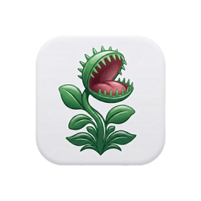

<p align="center">
  
</p>

<h1 align="center">Flytrap</h1>

<p align="center">
  <em>macOS menu-bar quick-capture for Obsidian</em>
</p>

<p align="center">
  <a href="https://github.com/jakobtfaber/flytrap/actions/workflows/test.yml"></a>
  
  
  
</p>

---

Flytrap is a macOS menu-bar app for capturing thoughts straight into an Obsidian vault. Press a hotkey, type or speak, hit save — your note lands as a timestamped entry in today's daily note. No clipboard step, no app switch, no friction.

## Features

- **Hotkey-driven capture panel.** A floating panel that appears above all spaces and full-screen apps. Toggle on, type or paste, save, dismiss.
- **Voice dictation.** A second hotkey toggles Apple's `SFSpeechRecognizer` to transcribe what you say into the panel as you speak.
- **Multi-modal entries.** Text, voice notes, dropped/pasted images and videos, and links are all captured as a single session.
- **Optional Claude cleanup.** With an Anthropic API key set in Settings, a one-click button reformats messy dictation into clean prose before save.
- **Append-only daily notes.** Every save lands in `<your-vault>/Captures/YYYY-MM-DD.md` under a `## H:mm a` time heading. Multiple captures across the same day go into the same file, separated by `---`.
- **Survives crashes.** In-flight drafts persist to `~/Library/Application Support/Flytrap/pending-session.json` until you save or discard.
- **Template menu-bar icon.** The Venus flytrap silhouette in your menu bar auto-tints to match light/dark mode.

## Hotkeys

| Key | Action |
|---|---|
| `Ctrl+Space` | Toggle capture panel |
| `Ctrl+Shift+Space` | Toggle voice dictation |
| `Esc` (tap) | Close panel |
| `Esc` (hold ~1.5s) | Discard current draft |

Right-click the menu-bar icon for Settings and Quit.

## Build & install

Requires macOS 14+ and Xcode 15+. Build via `xcodebuild` so the bundled icon resources land in the .app correctly:

```bash
git clone git@github.com:jakobtfaber/flytrap.git
cd flytrap

xcodebuild \
  -project Flytrap.xcodeproj \
  -scheme Flytrap \
  -configuration Release \
  -derivedDataPath build \
  CODE_SIGN_IDENTITY="-" CODE_SIGNING_REQUIRED=NO CODE_SIGNING_ALLOWED=NO \
  build

cp -R build/Build/Products/Release/Flytrap.app /Applications/
open /Applications/Flytrap.app
```

On first launch the app sits in your menu bar (no Dock icon — `LSUIElement` is `true`). Right-click the icon to open Settings and set your vault path. The default is `/Users/jakobfaber/Obsidian/`.

To run the test suite:

```bash
swift test
```

## Output format

Flytrap writes to `<vault-path>/Captures/<YYYY-MM-DD>.md`. The format is deliberately compatible with downstream Obsidian workflows:

```markdown
# 2026-04-29

## 12:20 PM

A free-form note. Can have multiple paragraphs.

- bullet items
- and links

---

## 1:00 PM

Next entry of the day. The `---` separator and `## H:mm a` heading
are how the file is parsed by downstream consumers.

![[attachments/screenshot.png|500]]
*screenshot.png*
```

The first entry of a day is preceded by a `# YYYY-MM-DD` heading, written only at file creation. Subsequent saves append (via `FileHandle.seekToEndOfFile`) — the file is not read-modify-written, so external Obsidian-side edits are safe as long as you save them before the next Flytrap save lands.

## Architecture

SwiftUI/AppKit hybrid, single executable target.

| Component | Responsibility |
|---|---|
| `Flytrap/FlytrapApp.swift` | `NSApplicationDelegate`; status item, floating panel, hotkey + escape monitors, transcription delegate. |
| `Flytrap/AppState.swift` | `@MainActor` `ObservableObject` coordinating the active session, dictation state, idle/auto-close timers, draft persistence. |
| `Flytrap/Models/CaptureSession.swift`<br>`Flytrap/Models/CaptureItem.swift` | Codable session + entry types. `toMarkdown(title:)` is the producer side of the on-disk format. |
| `Flytrap/Services/VaultWriter.swift` | Writes to `<vault>/Captures/YYYY-MM-DD.md`; new-file vs. append decision; copies media into `attachments/`. |
| `Flytrap/Services/TranscriptionService.swift` | Wraps `SFSpeechRecognizer` + `AVAudioEngine` with throttled RMS audio-level events for the waveform UI. |
| `Flytrap/Services/HotkeyManager.swift` | Carbon `EventHotKey` registration via the [HotKey](https://github.com/soffes/HotKey) package. |
| `Flytrap/Services/ClaudeService.swift` | Minimal `URLSession` client for Anthropic's `claude-haiku-4-5-20251001` cleanup endpoint. |
| `Flytrap/Helpers/Settings.swift` | `UserDefaults` accessors and the one-shot legacy-Zoidberg-defaults migration. |
| `Flytrap/Helpers/Permissions.swift` | Wrappers for Speech Recognition and Accessibility status checks. |
| `Flytrap/Helpers/EscapeKeyMonitor.swift` | Tap-vs-hold escape key monitor for close-vs-discard semantics. |
| `Flytrap/Views/` | SwiftUI views for the capture panel, settings, audio waveform, toasts. |

## Repository layout

```
.
├── Flytrap/                        # SwiftPM target
│   ├── FlytrapApp.swift
│   ├── AppState.swift
│   ├── Info.plist
│   ├── Models/
│   ├── Services/
│   ├── Helpers/
│   ├── Views/
│   ├── Flytrap.icns                # bundled app icon
│   ├── MenubarIcon.png             # bundled menu-bar template @1x
│   └── MenubarIcon@2x.png          # bundled menu-bar template @2x
├── FlytrapTests/                   # XCTest target (run via `swift test`)
├── Flytrap.xcodeproj/
├── Package.swift                   # SwiftPM manifest (mirrors xcodeproj)
├── assets/                         # icon source artwork + regen runbooks
│   ├── Flytrap.png                 # 2048×2048 master for the .icns
│   ├── Flytrap-Menubar.png         # menu-bar silhouette master
│   ├── icon-readme.png             # 256×256 README display icon
│   └── README.md                   # how to regenerate the bundled images
└── docs/
    ├── plans/                      # implementation plans
    └── specs/                      # original design notes
```

## History

Flytrap was originally a fork of [malecks/zoidberg](https://github.com/malecks/zoidberg) called "Zoidberg." It was renamed and migrated to an independent personal repository on 2026-04-29; the rename plan and execution log live in [`docs/plans/2026-04-29-rename-zoidberg-to-flytrap.md`](docs/plans/2026-04-29-rename-zoidberg-to-flytrap.md).

## License

Private personal repository. No license is granted for redistribution. Original Zoidberg code by malecks is used under the terms of its [upstream license](https://github.com/malecks/zoidberg).
